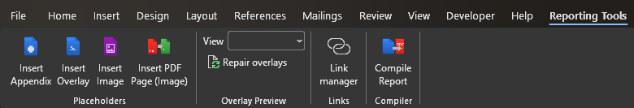
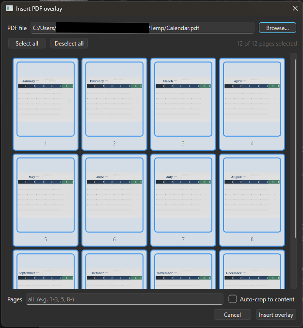
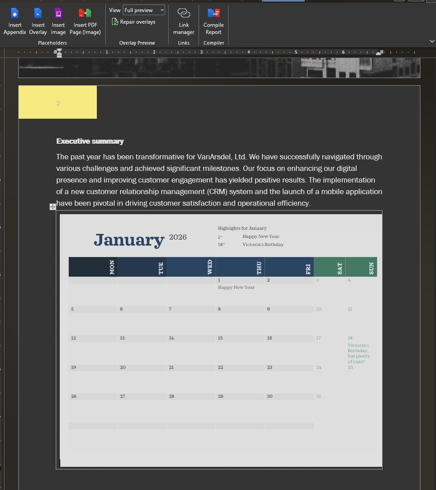
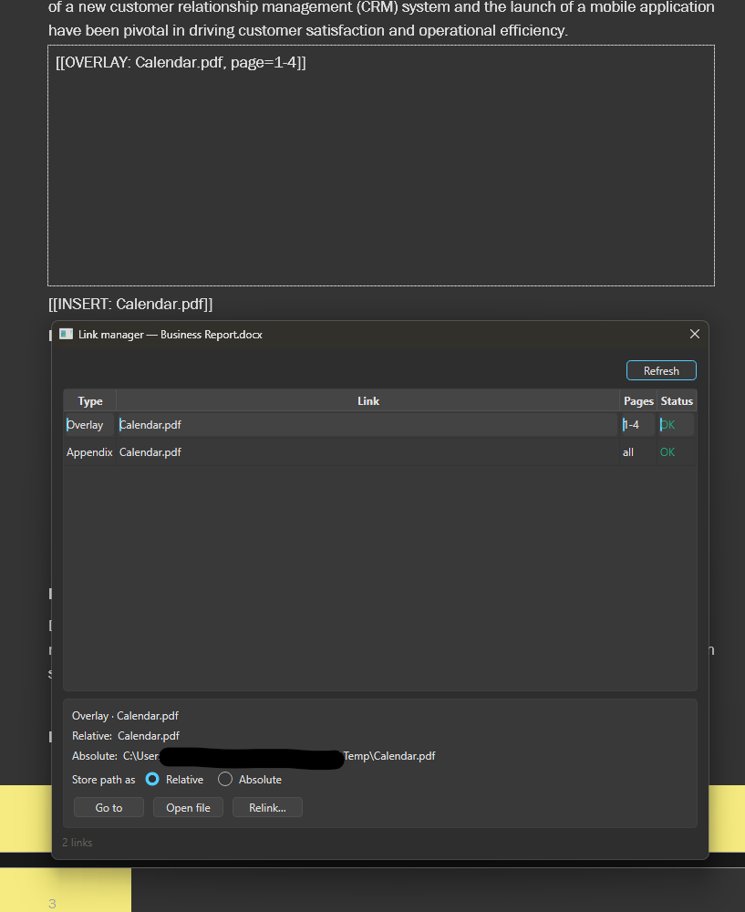

# Report Compiler

**Build polished PDF reports straight from Microsoft Word.** Write your report normally, drop in your drawings, calculations, and appendices with a few ribbon buttons, and click **Compile** to get one clean PDF with everything stitched together.

No more printing to PDF, re-combining files by hand, or fixing page order every time a drawing changes.



---

## What you can do

Inside Word you get a **Reporting Tools** tab with buttons for:

| Button | What it does |
|--------|--------------|
| **Insert Appendix** | Add an entire PDF (or specific pages) as full pages in your report |
| **Insert Overlay** | Drop a PDF page (e.g. a sketch or detail) into a box, sized to fit, with a live page picker |
| **Insert Image** | Place an image file (PNG, JPG, …) into a box |
| **Insert PDF Page (Image)** | Convert a PDF page to a crisp image and insert it |
| **Overlay view** | Flip the whole document between *Tags*, *Quick preview*, and *Full preview* so you can see exactly which pages will be inserted |
| **Link manager** | See every linked file in one list, check which paths are valid, and fix broken links |
| **Compile Report** | Turn the whole document into the final PDF |

You keep writing in Word the way you always have. The buttons just insert little **placeholders** that say "put this PDF here," and **Compile** replaces them with the real content.

---

## A typical workflow

1. Write your report in Word.
2. Where you want a drawing or appendix, click **Insert Overlay** or **Insert Appendix** and pick the file.
3. (Optional) Use **Overlay view → Full preview** to see how the inserted pages will look in place.
4. Click **Compile Report**. A finished PDF is created next to your document.

That's it. If a drawing changes, just replace the file and re-compile — the report updates itself.

### Insert Overlay — pick exactly the pages you want

When you click **Insert Overlay**, a window shows thumbnails of the PDF's pages. Type a page range or click thumbnails; the selected pages are highlighted so you always know what you're inserting.



### Overlay view — preview in place

By default overlays show as small placeholders. Switch **Overlay view** to **Full preview** to render the actual pages right in the document and see how everything reflows; switch back to **Tags** when you're done. (Previews are just for looking — your final compile always uses the original full-resolution PDFs.)



### Link manager — keep your references healthy

Open the **Link manager** to see every file your report links to, whether each path is still valid, and jump to or relink anything that moved.



---

## One-time setup (Windows)

You only do this once per computer. If you're not comfortable with the steps below, your IT or a colleague can run them for you — after that, everything happens with the Word buttons.

Open **PowerShell** and run:

```powershell
# 1. Install uv (the small tool that runs Report Compiler). Skip if already installed.
winget install --id=astral-sh.uv -e

# 2. Turn on the Word buttons (registers the helper that Word talks to — no admin needed)
uvx report-compiler com-server register

# 3. Add the Report Compiler ribbon to Word
uvx report-compiler word-integration install
```

Then **restart Word** — you'll see the **Reporting Tools** tab.

To check or undo the setup later:

```powershell
uvx report-compiler com-server status        # is the helper registered?
uvx report-compiler word-integration status   # is the ribbon installed?
uvx report-compiler word-integration remove    # remove the ribbon
```

**Requirements:** Windows, Microsoft Word, and an internet connection the first time (uv downloads what it needs, including the right Python). See [WORD_INTEGRATION.md](WORD_INTEGRATION.md) for a detailed setup and troubleshooting guide.

---

## If something goes wrong

| Message | What to do |
|---------|------------|
| *"Please save the document first"* | Save your Word document, then try again (links are stored relative to where the document lives). |
| *"COM Server Not Registered"* | Run `uvx report-compiler com-server register` once, then retry. |
| A link shows **Missing** in the Link manager | The file moved or was renamed — use **Relink** to point it at the new location. |
| Compile fails on a PDF | Open the Link manager to find the broken link, or check the page numbers exist in the source PDF. |

---

## For power users — command line

Everything the buttons do can also be run from a terminal.

```powershell
# Compile a document to PDF (output defaults to the same name with .pdf)
uvx report-compiler compile report.docx report.pdf

# Convert PDF page(s) to SVG
uvx report-compiler svg-import drawing.pdf out.svg --page 1-3

# Interactive menu (compile, convert, manage the Word integration)
uvx report-compiler
```

### Placeholder reference

The buttons insert these tags for you, but you can also type them by hand. All paths are relative to the Word document (absolute paths also work).

```text
[[INSERT: appendices/calcs.pdf]]            All pages of a PDF as full pages
[[INSERT: appendices/calcs.pdf:1-3,7]]      Specific pages (1–3 and 7)
[[INSERT: chapters/intro.docx]]             Another Word doc, compiled and inserted

[[OVERLAY: drawings/sketch.pdf]]            A PDF page placed in a 1-cell table
[[OVERLAY: drawings/sketch.pdf, page=2]]    A specific page
[[OVERLAY: drawings/sketch.pdf, crop=true]] Trim surrounding whitespace

[[IMAGE: photos/site.png]]                  An image in a 1-cell table
[[IMAGE: photos/site.png, width=3in]]       With a set width
```

Page ranges accept single pages (`5`), ranges (`1-3`), lists (`1,3,5`), open ranges (`2-`), and combinations (`1-3,7,9-`).

### Working files and caching

Temporary files go to your system temp folder (not next to the document, which avoids OneDrive/SharePoint sync issues), and compiled appendices are cached so re-runs are fast. Override with `--temp-dir` / `--cache-dir` or the `REPORT_COMPILER_TEMP_DIR` / `REPORT_COMPILER_CACHE_DIR` environment variables; disable caching with `--no-cache`.

---

## Documentation

- [WORD_INTEGRATION.md](WORD_INTEGRATION.md) — detailed Word setup, the ribbon, and how the template is built
- [DEVELOPER_GUIDE.md](DEVELOPER_GUIDE.md) — architecture and contributing

## License

MIT — see [LICENSE](LICENSE).
